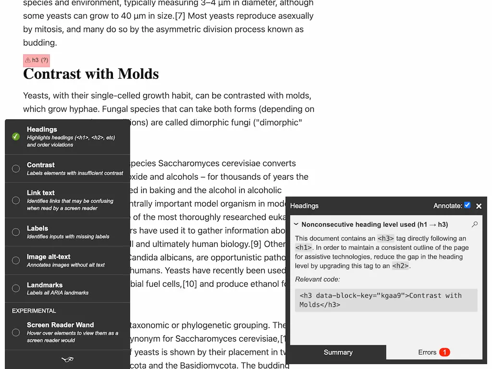

# [wagtail-accessibility](https://pypi.org/project/wagtail-accessibility/)

✅ Accessibility content checks for Wagtail websites. Try it out on our [static demo page](https://wagtail-nest.github.io/wagtail-accessibility/)!

---

[](https://wagtail-nest.github.io/wagtail-accessibility/)

## Why you need this

As of Wagtail 4.2, Wagtail has [built-in accessibility checks](https://wagtail.org/blog/introducing-wagtails-new-accessibility-checker/). However those checks are only based on automation – and are only set up for scenarios where the checks can always provide correct results, rather than leaving room for interpretation.

In contrast, wagtail-accessibility focuses on providing tools to support CMS users with their _manual_ testing:

- Visualising headings in use on the page, to check whether there are enough
- Checking for color contrast
- Checking link text for common possible mistakes
- Identifying inputs with missing labels
- Highlighting images without alt text
- Visualising landmarks in use on the page

It also integrates a "screen reader wand", for CMS users to preview how a given element would appear for a screen reader.

---

For more details about the future of accessibility checks in Wagtail, read [Looking for sponsorship – Accessibility checks for site administrators](https://wagtail.org/blog/looking-for-sponsorship-accessibility-checks-for-site-administrators/).

## Installing

Install using pip:

``` bash
pip install wagtail-accessibility
```

Then add `wagtailaccessibility` to your `INSTALLED_APPS`. It works with Wagtail 4.1 and upwards.

## Using

This plugin, when added to your template, will add [tota11y](https://github.com/jdan/tota11y) to all page previews.
Tota11y is an accessibility visualization toolkit.

To use it, simply include this in your template, and from now on all page previews will include it.

```jinja2


```

## Jinja2

This plugin also contains a jinja2 implementation, to use it, include
the following in your config.

```python
{
    'BACKEND': 'django.template.backends.jinja2.Jinja2',
    'OPTIONS': {
        'extensions': [
            # […]
            'wagtailaccessibility.jinja2tags.tota11y',
        ],
    },
}
```

The template tag can then be used like so:

```jinja2
{{ tota11y() }}
```
